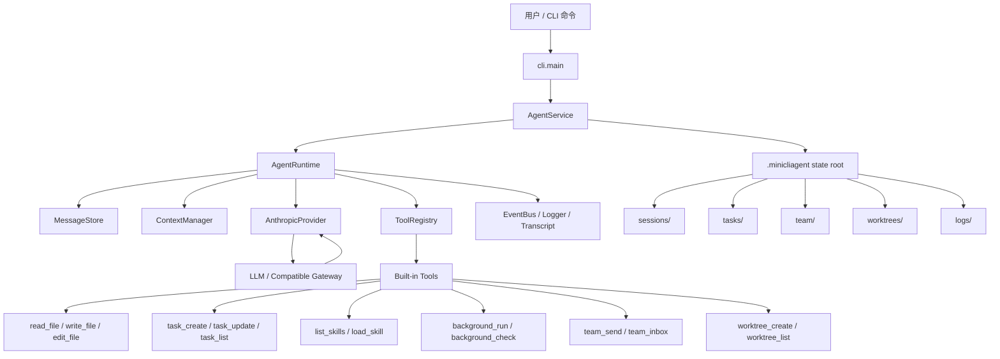

# MiniCLIAgent 开发规格说明

## 1. 文档目标

本文档定义 MiniCLIAgent 的产品边界、运行时结构、模块职责和工程约束。

它服务于三个目标：

1. 说明这个项目到底要构建什么
2. 给后续实现和测试提供统一边界
3. 为后续维护与扩展提供一致的设计基线

本文档描述的是正式项目规格，不是开发过程记录，也不是个人简历说明。

## 2. 项目定位

MiniCLIAgent 是一个面向本地开发环境的 Python CLI Agent 项目。

它的定位是：

- 一个可运行、可测试、可扩展的本地 agent harness
- 一个强调工具调用、状态落盘、任务管理和工作区隔离的实验平台
- 一个可作为 agent 工程参考实现的本地项目

它不是：

- 图形化工作流平台
- 远程 SaaS Agent 服务
- 复杂的企业权限编排系统
- 全功能多模型管理平台

项目的核心原则是：

> 模型负责推理，代码负责 harness。

## 3. 设计目标

### 3.1 功能目标

1. 提供一个基于 Anthropic SDK 风格接口的本地 CLI Agent 运行时
2. 支持 tool calling，并通过统一的 `ToolRegistry` 管理工具
3. 支持 `skills / tasks / team / worktree / background tasks`
4. 支持会话消息持久化与上下文压缩
5. 支持在本地 git 仓库中进行 task 与 worktree 绑定

### 3.2 工程目标

1. 模块边界清晰
2. 默认行为可读、可测、可维护
3. 运行时主链路、状态面和工具系统保持可审查、可验证
4. 扩展新工具、新状态或新 provider 时尽量是加法式修改

## 4. 非目标

当前阶段不做以下内容：

1. Web GUI 或桌面 GUI
2. 完整 MCP runtime
3. 多 provider 全量统一抽象
4. 企业级权限系统
5. 分布式任务调度
6. 持续常驻的 daemon / cron 系统

## 5. 总体架构

项目采用四层结构：

- `CLI`
- `App`
- `Core`
- `Infra`

四层的关系是：

- `CLI` 负责命令入口和用户可见输出
- `App` 负责组装服务和用例流程
- `Core` 负责 agent 运行时与领域逻辑
- `Infra` 负责文件系统、shell、git、日志等外部实现

### 5.1 分层职责

#### CLI 层

职责：

- 解析参数
- 调用 `AgentService`
- 输出人类可读结果
- 将常见错误转换为友好的 CLI 提示

不负责：

- agent loop
- provider 协议细节
- 业务规则实现

#### App 层

职责：

- 组装 runtime、services、registry、state 目录
- 处理面向用户的 use case
- 连接 CLI 与 Core

典型对象：

- `AgentService`
- `TaskService`
- `SkillService`
- `TeamService`
- `WorktreeService`

#### Core 层

职责：

- 定义运行时主循环
- 定义 provider 抽象与请求/响应模型
- 定义工具系统
- 定义上下文压缩、task、skill、team、worktree 等核心能力

这是项目的主体层。

#### Infra 层

职责：

- 文件路径安全处理
- shell 命令执行
- git worktree 操作
- 结构化日志与 transcript 落盘

Infra 负责“怎么做”，不负责“为什么做”。

## 6. 运行时结构图

下面这张图描述一次典型 `run --prompt` 调用的运行路径。



### 6.1 一次运行的最小闭环

一次最小运行包含以下步骤：

1. CLI 读取命令与参数
2. `AgentService` 组装 runtime 和依赖
3. `AgentRuntime` 读取 session 消息
4. `ContextManager` 准备上下文
5. `AnthropicProvider` 发起模型请求
6. 如果模型请求工具，则通过 `ToolRegistry` 执行
7. 工具结果回写到 session
8. transcript、events、logs 落盘
9. 返回最终文本给 CLI

## 7. 核心模块规格

### 7.1 AgentRuntime

`AgentRuntime` 是运行时主编排对象。

职责：

- 构造 `ModelRequest`
- 调用 provider
- 处理 tool loop
- 写入消息存储
- 注入 background 通知
- 记录 loaded skills 与 working memory
- 输出最终 turn 结果

约束：

- 不直接处理 CLI 参数
- 不直接操作 git
- 不直接知道 `.env` 的细节

### 7.2 LLM Provider

当前主 provider 为 `AnthropicProvider`。

要求：

- 接收统一的 `ModelRequest`
- 返回统一的 `ModelResponse`
- 支持 tool schema 下发
- 支持 Anthropic 兼容接口
- 对已知兼容网关做必要的 URL 归一化

设计原则：

- 先把 Anthropic-first 路径做好
- 保留 provider adapter 边界
- 不为了“未来也许会支持很多家”而提前过度抽象

### 7.3 ToolRegistry

`ToolRegistry` 是工具系统的统一入口。

职责：

- 注册 `ToolSpec`
- 提供工具列表给 provider adapter
- 执行工具并返回 `ToolResult`

要求：

- 工具声明必须显式包含 `name / description / input_schema / handler`
- 工具扩展应尽量只通过注册完成
- 内置工具应按职责拆分到 `core/tools/builtins/`

### 7.4 ContextManager

`ContextManager` 负责控制上下文规模。

当前策略分三层：

1. 工具结果裁剪
2. 旧工具结果微压缩
3. 历史消息压缩

同时保留 working memory，例如：

- 已加载的 skill
- 当前 task 状态
- request_id
- teammate 相关状态

约束：

- 不在 `messages[]` 中注入不兼容的 `role=system`
- provider 特定限制应在运行时链路中被正确处理

### 7.5 Skill System

skill 系统负责从本地工作区发现与加载 `SKILL.md`。

要求：

- skill 扫描路径为 `<workspace>/skills/**/SKILL.md`
- 支持 `list_skills`
- 支持 `load_skill`
- 支持基础 matcher
- runtime 应记录已加载 skill

### 7.6 Task System

task 系统负责持久化任务状态。

要求：

- 支持 `create / update / list`
- 任务数据存放在 `.minicliagent/tasks/`
- 支持 `status / owner / priority / labels / blocked_by / worktree`

设计目标：

- 结构简单
- 易读
- 便于直接检查 JSON 状态

### 7.7 Background Tasks

background 系统负责后台 shell 执行。

要求：

- 支持启动后台任务
- 支持查询状态
- 支持结果 drain
- 至少支持 `running / completed / timeout / error / cancelled`

### 7.8 Team System

team 系统负责轻量级 agent 间消息与协议。

要求：

- 支持基础 inbox 消息收发
- 支持 `request_id`
- 支持协议消息类型，例如：
  - `shutdown_request / shutdown_response`
  - `plan_approval_request / plan_approval_response`
  - `task_claim / task_claim_result`

设计原则：

- 先实现可读、可测的本地协议
- 不把它做成复杂的分布式消息系统

### 7.9 Worktree System

worktree 系统负责把 task 与 git 工作区隔离结合起来。

要求：

- 自动检测 repo root
- 创建和列出 worktree
- 记录 worktree 元数据
- 支持 task 与 worktree 双向绑定
- 支持在指定 worktree 执行命令

约束：

- 非 git 工作区下要返回可读错误
- 不应把 git 原生命令输出直接泄漏给最终用户

## 8. 状态目录约定

所有本地状态统一放在 `.minicliagent/` 下。

目录约定如下：

```text
.minicliagent/
├─ sessions/
├─ tasks/
├─ team/
├─ worktrees/
└─ logs/
```

说明：

- `sessions/` 保存会话消息
- `tasks/` 保存任务 JSON
- `team/` 保存本地消息与 inbox 数据
- `worktrees/` 保存 worktree 元数据
- `logs/` 保存事件、结构化日志和 transcript

## 9. 仓库结构要求

正式产品代码位于：

- `minicliagent/`

参考样例代码位于：

- `examples/learn-claude-code/`

要求：

- 正式运行时不得依赖样例脚本作为主入口
- 样例材料可以保留，但边界必须清晰

## 10. 测试策略

项目测试分为三层：

### 10.1 Unit Tests

覆盖：

- 配置
- provider adapter
- runtime 局部逻辑
- tools
- skills
- tasks
- team
- worktree
- logging / transcript

### 10.2 Integration Tests

覆盖：

- CLI 命令
- runtime tool loop
- state 持久化
- runtime 与事件/日志联动

### 10.3 Live Tests

覆盖：

- 真实模型链路
- 真实工具编排
- 真实用户场景

要求：

- 默认测试不依赖 live provider
- live smoke test 通过显式环境变量开启

## 11. 文档要求

项目至少维护以下文档：

- `dev_spec.md`：开发规格说明
- `code_spec.md`：实现状态清单
- `README.md`：中文首页说明
- `docs/getting-started/learning-path.md`：学习路径
- `docs/testing/...`：测试报告

文档目标：

- 让工程边界清晰
- 让实现状态可追踪
- 让测试结果可复盘

## 12. 设计约束

本项目后续演进应遵守以下约束：

1. 不为了“未来可能需要”而提前引入重抽象
2. 默认优先可读性和可验证性
3. 新增功能优先沿用现有分层与模式
4. 用户可见错误必须尽量简洁、明确
5. 参考实现不等于原型代码，仍需保持工程纪律

## 13. 当前阶段结论

当前版本的开发方向应保持为：

- 一个本地可运行的、Anthropic-first 的 CLI Agent 项目
- 一个通过 `skills / tasks / background / team / worktree` 展示 agent harness 设计的实践项目
- 一个可作为本地 agent harness 参考实现的工程项目

后续所有实现工作，均应以本规格作为边界，而不是继续向无上限的“大而全 agent 平台”扩张。
